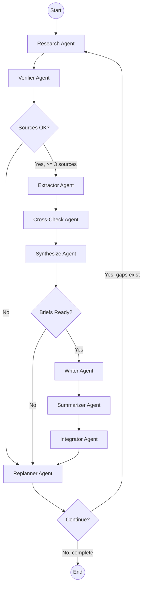

# Prolific

A LangGraph-based multi-agent system for generating well-researched, coherent long-form content (books, research articles, white papers) on any topic.

## Overview

Prolific uses a pipeline of specialized AI agents to research, verify, extract, synthesize, and write content with proper citations. The system is designed to produce 50,000+ word manuscripts while maintaining consistency and factual accuracy.

**Input**: Topic, subtopics, focus areas, target word count, depth level, style preferences

**Output**: Complete manuscript with citations, claims ledger, and source documentation

## Architecture

### LangGraph Workflow

The system uses a state machine workflow with conditional routing and replan loops:



### Agent Responsibilities

| Agent | Purpose | Input | Output |
|-------|---------|-------|--------|
| **Research** | Find relevant sources via web search | Topic, subtopics | SourceCandidate[] |
| **Verifier** | Validate source credibility and recency | SourceCandidate[] | ApprovedSource[] |
| **Extractor** | Extract claims and evidence from sources | ApprovedSource[] | Claim[], EvidenceSnippet[] |
| **Cross-Check** | Verify claims across multiple sources | Claim[] | Claim[] (updated confidence) |
| **Synthesize** | Create chapter briefs from claims | Claim[], Outline | ChapterBrief[] |
| **Writer** | Generate prose from briefs with citations | ChapterBrief[] | DraftChunk[] |
| **Summarizer** | Update global book memory | DraftChunk[] | GlobalMemory |
| **Integrator** | Check consistency across chapters | DraftChunk[] | Consistency report |
| **Replanner** | Identify gaps and decide next steps | All artifacts | ContentGap[], routing decision |

## Project Structure

```
prolific/
├── api/v1/
│   ├── projects.py       # Project CRUD endpoints
│   └── generation.py     # Content generation streaming endpoint
├── agent/
│   ├── state.py          # ContentGenerationState definition
│   ├── graph.py          # LangGraph workflow assembly
│   ├── prompts.py        # System prompts for agents
│   └── nodes/
│       ├── research.py   # Research agent node
│       ├── verify.py     # Verification agent node
│       ├── extract.py    # Extraction agent node
│       ├── cross_check.py # Cross-checking agent node
│       ├── synthesize.py # Synthesis agent node
│       ├── write.py      # Writing agent node
│       ├── summarize.py  # Summarization agent node
│       ├── integrate.py  # Integration agent node
│       └── replan.py     # Replanning agent node
├── schemas/
│   ├── artifacts.py      # Pydantic models (Claim, Source, etc.)
│   └── memory.py         # Memory structures
├── rag/
│   ├── indexes.py        # ChromaDB collection setup
│   ├── retrieval.py      # RAG retrieval service
│   └── deduplication.py  # Content deduplication
├── services/
│   ├── llm.py            # Tiered LLM provider abstraction
│   ├── embedding.py      # Embedding service
│   ├── web_search.py     # Tavily web search integration
│   └── web_fetch.py      # URL content fetching
├── tools/
│   ├── research_tools.py
│   ├── extraction_tools.py
│   ├── writing_tools.py
│   └── verification_tools.py
├── core/
│   ├── config.py         # Pydantic BaseSettings
│   └── database.py       # SQLAlchemy async setup
├── models/               # SQLAlchemy ORM models
└── main.py               # FastAPI application entry
```

## Tiered Model Strategy

Prolific uses different models for different tasks to optimize cost:

| Tier | Model | Use Case |
|------|-------|----------|
| Research | google/gemini-3-flash-preview | Web search queries, source discovery |
| Extraction | google/gemini-3-flash-preview | Claim extraction, evidence parsing |
| Verification | google/gemini-3-flash-preview | Source credibility, claim verification |
| Writing | anthropic/claude-sonnet-4.5 | Final prose generation with citations |

## Three-Index RAG Strategy

| Index | Contents | Purpose |
|-------|----------|---------|
| **Book Memory** | Rolling summaries, glossary, outlines | Writers retrieve what has been covered |
| **Draft Chunks** | Written paragraphs | Deduplication gate (reject >85% similarity) |
| **Evidence/Claims** | Snippets and verified claims | Writers retrieve supporting evidence |

## Getting Started

### Prerequisites

- Python 3.11+
- Node.js 18+ (for frontend)

### Installation

1. Clone the repository:
```bash
git clone https://github.com/yourusername/prolific.git
cd prolific
```

2. Create and activate a virtual environment:
```bash
python -m venv venv
source venv/bin/activate  # On Windows: venv\Scripts\activate
```

3. Install Python dependencies:
```bash
pip install -r requirements.txt
```

4. Install frontend dependencies:
```bash
cd frontend
npm install
cd ..
```

5. Copy the environment template and configure:
```bash
cp .env.example .env
# Edit .env with your API keys
```

### Required API Keys

- `OPENROUTER_API_KEY` - For LLM access via OpenRouter
- `OPENAI_API_KEY` - For embeddings (text-embedding-3-small)
- `TAVILY_API_KEY` - For web search

### Running the Application

1. Start the backend:
```bash
uvicorn prolific.main:app --reload --port 8000
```

2. Start the frontend (in a separate terminal):
```bash
cd frontend
npm run dev
```

3. Open http://localhost:3000 in your browser

## Configuration

Key environment variables in `.env`:

```bash
# LLM Models
RESEARCH_MODEL=google/gemini-3-flash-preview
EXTRACTION_MODEL=google/gemini-3-flash-preview
WRITING_MODEL=anthropic/claude-sonnet-4.5
VERIFICATION_MODEL=google/gemini-3-flash-preview

# Workflow Limits
MAX_RESEARCH_ITERATIONS=5
MAX_SOURCES_PER_TOPIC=20
MAX_CLAIMS_PER_SOURCE=50

# Token Budgets
BOOK_MEMORY_BUDGET=2000
DRAFT_CHUNK_BUDGET=1500
EVIDENCE_BUDGET=4000
```

## Cost Estimates

For a 100-page book (~50,000 words):

| Phase | Est. Cost |
|-------|-----------|
| Research (web search) | ~$0.03 |
| Source Verification | ~$0.28 |
| Claim Extraction | ~$1.20 |
| Cross-Checking | ~$0.42 |
| Chapter Synthesis | ~$2.10 |
| Writing (Sonnet 4.5) | ~$5.40 |
| Editing/Integration | ~$2.10 |
| **Total** | **~$11.50** |

## API Endpoints

### POST /api/v1/generation/stream

Start content generation with SSE streaming:

```bash
curl -X POST http://localhost:8000/api/v1/generation/stream \
  -H "Content-Type: application/json" \
  -d '{
    "topic": "Your topic here",
    "subtopics": ["subtopic1", "subtopic2"],
    "target_word_count": 50000,
    "depth": "standard"
  }'
```

### GET /api/v1/projects

List all generation projects.

### GET /api/v1/projects/{id}

Get a specific project with its generated content.

## License

MIT
